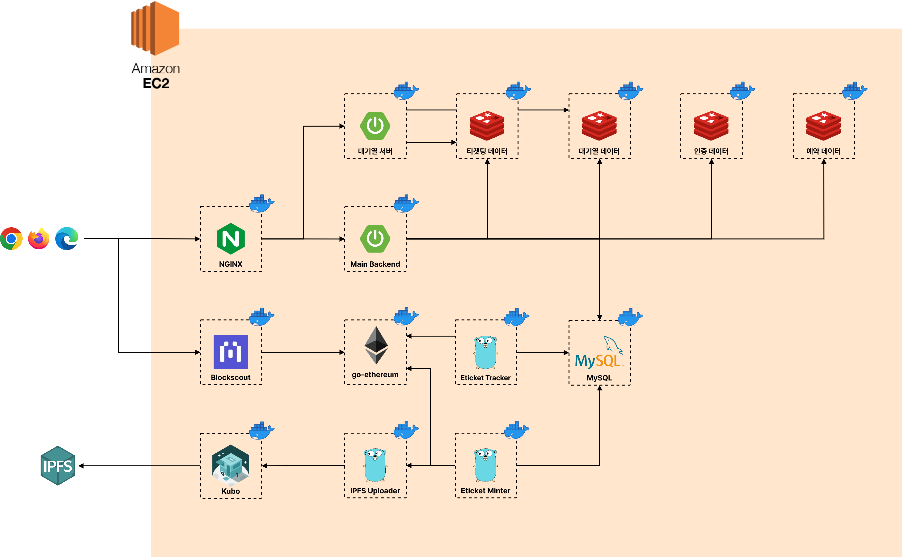
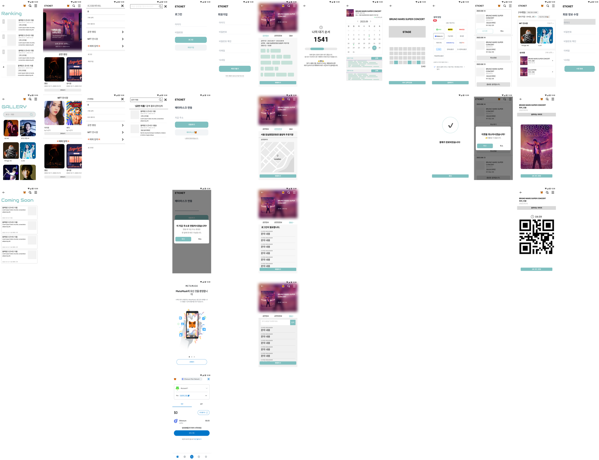

# 에티켓, NFT 티켓 플랫폼  

> 프로젝트 진행 기간: 2023.08.21. ~ 2023.10.06.  

## 목차

- [에티켓, NFT 티켓 플랫폼](#에티켓-nft-티켓-플랫폼)
  - [목차](#목차)
  - [프로젝트 개요](#프로젝트-개요)
  - [서비스 기능](#서비스-기능)
  - [팀원](#팀원)
    - [담당 업무](#담당-업무)
  - [서비스 아키텍처](#서비스-아키텍처)
  - [와이어프레임](#와이어프레임)
  - [개발 환경](#개발-환경)

## 프로젝트 개요

- 프로젝트 배경  
  - 암표로 인해 소비자는 정당한 경쟁으로 공연을 관람할 수 있는 기회를 박탈  
  - 지속적으로 증가하는 암표 거래 문제는 20년에 비해 22년에 신고 누적 횟수 약 12배 증가  

- 프로젝트 목표  
  - 현물 티켓이 아닌 NFT 티켓을 발급하여 티켓의 위조 방지 및 소유 증명  
  - NFT 티켓을 활용한 티켓의 일회성 소모품이 아닌 소장품으로의 전환  

- 기대효과
  - 공정한 경쟁 환경을 조성하여 컨텐츠 제공자와 소비자의 권리 보호  
  - NFT 굿즈를 통해 팬덤 강화 및 소비 촉진 효과  

## [서비스 기능](./docs/features.md)

[📑 기능 명세서](https://noon-spider-571.notion.site/3bb123090ddd48a68e68eeec8e417335?v=a328eb746e92433d98957a87ea8f6be9)  
[👀 모든 기능 자세히 둘러보기](./docs/features.md)  

- [서비스 기능](#서비스-기능)
  - [MetaMask 연동](./docs/features.md#metamask-연동)
  - [MetaMask 로그인](./docs/features.md#metamask-로그인)
  - [공연 랭킹 조회](./docs/features.md#공연-랭킹-조회)
  - [공연 상세 정보 조회](./docs/features.md#공연-상세-정보-조회)
  - [공연 일자 선택](./docs/features.md#공연-일자-선택)
  - [티켓 구매 대기열](./docs/features.md#티켓-구매-대기열)
  - [공연 좌석 선택](./docs/features.md#공연-좌석-선택)
  - [결제](./docs/features.md#결제)
  - [구매 내역 조회](./docs/features.md#구매-내역-조회)
  - [티켓 구매 취소](./docs/features.md#티켓-구매-취소)
  - [내 티켓 조회](./docs/features.md#내-티켓-조회)
  - [티켓 QR 코드 생성](./docs/features.md#티켓-qr-코드-생성)

## 팀원

| 팀장 오영재                                                                                                                                            | 고우민                                                                                                                                           | 기대성                                                                                                                                          | 유연석                                                                                                                                            | 이금규                                                                                                                                             | 최찬석                                                                                                                                                   |
| ------------------------------------------------------------------------------------------------------------------------------------------------------ | ------------------------------------------------------------------------------------------------------------------------------------------------ | ----------------------------------------------------------------------------------------------------------------------------------------------- | ------------------------------------------------------------------------------------------------------------------------------------------------- | -------------------------------------------------------------------------------------------------------------------------------------------------- | -------------------------------------------------------------------------------------------------------------------------------------------------------- |
|  |  |  |  |  |  |

### 담당 업무

🙋🏻‍♂️ 고우민 - Back-end

- 데이터베이스 스키마 설계  
- WebSocket과 Spring Scheduler를 사용한 대기열 시스템 구현  
- 티켓 예약, 취소 및 조회 API 구현  

🙋🏻‍♂️ 기대성 - Back-end, Blockchain, DevOps

- 데이터베이스 스키마 설계  
- Spring Security 프레임워크 기반 JWT 인증 기능 구현  
- Spring Security 프레임워크 기반 Ethereum Personal Sign 인증 기능 구현  
- Ethereum 스마트 컨트랙트 및 테스트 코드 작성  
- NFT 발급 및 NFT 이동 추적 서비스 작성  
- IPFS 파일 업로드 서비스 작성  
- 개발 편의성 제공을 위한 셸 스크립트 작성 및 관리  
- 서버 인프라 구성 및 서비스 배포 관리  

🙋🏻‍♂️ 오영재 - Front-end

- 토스 결제 API 사용, 결제 페이지 기능 구현 및 디자인
- react-material-ui-carousel 라이브러리와 MUI로 메인 페이지 기능 구현 및 디자인
- 최근 검색어 및 검색 페이지 기능 구현 및 디자인

🙋🏻‍♂️ 유연석 - Back-end

- 데이터베이스 스키마 설계
- 공연 정보 조회 API 구현
- 공연 별 좌석 선택 API 구현

🙋🏻‍♂️ 이금규 - DevOps, Front-end

- 개발 편의성 제공을 위한 셸 스크립트 작성 및 관리  
- 서버 인프라 구성 및 서비스 배포 관리 
- 와이어프레임 설계
- Recoil로 상태를 관리하여 모든 페이지에서 사용 가능한 Drawer 기능 구현 및 디자인
- 콘서트 랭킹 리스트 및 디테일 페이지 제작
- 콘서트 날짜 및 좌석 선택 페이지 제작
- Stomp.js로 Websocket연결, 실시간 통신으로 대기열 페이지 기능 구현 및 디자인

🙋🏻‍♂️ 최찬석 - Front-end, Blockchain

- 마이페이지 기능 구현 및 디자인
- MetaMask와 웹페이지 연결
- Web3.js를 사용해 마이페이지에 NFT 출력
- 마이페이지에 티켓 QR 코드 생성

## 서비스 아키텍처  

  

## 와이어프레임  

  

## 개발 환경  

- Back-End
  - MySQL 8.1.0
  - Redis 7.2
  - OpenJDK 17.0.7
  - Spring Boot 3.1.2
    - Spring Web MVC
    - Spring Security
    - Spring Data JPA
    - Spring Data Redis
  - Go 1.21.1
  - uber.go/fx 1.20.0
  - sqlc
  - gin 1.9.1
  - go-ethereum 11.13.2
  - hardhat
- Front-End
  - React 18.2.0
  - TypeScript 5.0.2
  - SCSS 1.66.1
  - Material-UI 5.14.8
  - Recoil 0.7.7
  - axios 1.5.0
  - Stomp 7.0.0
  - Vite 4.4.5
  - yarn 1.22.19
- Tools
  - Docker
  - Docker Compose
  - NGINX
- Other Dependencies
  - ipfs/kubo 0.22.0
